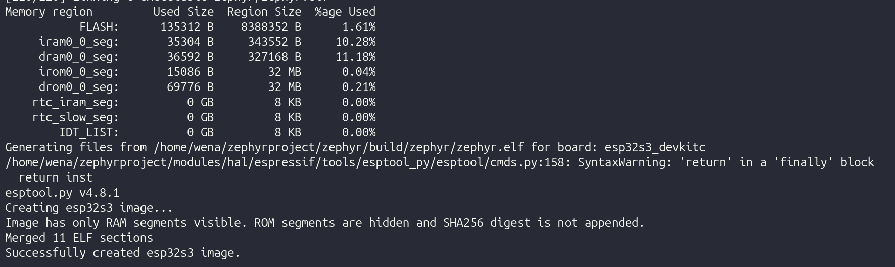

# Bagian 1 — Workspace dan Toolchain

Sebelum menulis satu baris kode pun, ada satu hari kerja (kalau lancar) yang harus dihabiskan cuma untuk menyiapkan lingkungan build. Zephyr tidak seperti Arduino IDE yang tinggal klik install — ada beberapa lapis yang harus dipasang berurutan: dependensi sistem, Python venv, west (tool CLI Zephyr), workspace manifest, Zephyr SDK (toolchain compiler untuk semua arsitektur), dan khusus untuk ESP32-S3 ada toolchain serta blob biner tambahan dari Espressif. Urutannya penting, jangan diloncat.

Semua perintah di bawah saya jalankan di Ubuntu 24.04 LTS bersih (fresh install di VM). Saya juga sudah uji ulang di Ubuntu 22.04 dan hasilnya sama, hanya versi beberapa paket apt yang beda tapi tidak berpengaruh.

## Dependensi sistem

Install paket-paket dasar yang dibutuhkan west, CMake, device tree compiler, dan toolchain build:

```bash
sudo apt update
sudo apt upgrade -y
sudo apt install -y --no-install-recommends git cmake ninja-build gperf \
  ccache dfu-util device-tree-compiler wget \
  python3-dev python3-venv python3-tk xz-utils file make gcc \
  gcc-multilib g++-multilib libsdl2-dev libmagic1 \
  libusb-1.0-0-dev
```

Cek versi CMake dan Python — Zephyr butuh CMake minimal 3.20 dan Python minimal 3.10. Ubuntu 22.04 default sudah cukup baru untuk keduanya, jadi biasanya tidak perlu upgrade manual.

```bash
cmake --version
python3 --version
```

Kalau `libusb-1.0-0-dev` tidak ditemukan di Ubuntu Anda (versi lama), cek nama paketnya lewat `apt search libusb-1.0`.

## Python virtual environment

Jangan install west atau paket Python Zephyr lain secara global dengan `pip install --user` atau lebih parah `sudo pip install`. Ini akan bentrok dengan paket Python sistem dan menyulitkan upgrade nanti. Pakai venv:

```bash
mkdir -p ~/zephyrproject
python3 -m venv ~/zephyrproject/.venv
source ~/zephyrproject/.venv/bin/activate
```

Setelah diaktifkan, prompt shell akan menampilkan `(.venv)` di depan. Setiap kali mau kerja dengan Zephyr, venv ini harus diaktifkan dulu. Saya biasanya menambahkan alias di `~/.bashrc` atau `~/.zshrc`:

```bash
echo 'alias zephyr-env="source ~/zephyrproject/.venv/bin/activate"' >> ~/.zshrc
```

## Install west

West adalah tool CLI yang mengatur multi-repository manifest Zephyr (mirip `repo` di proyek Android atau `vcstool` di ROS). Install di dalam venv yang tadi diaktifkan:

```bash
pip install west
```

Sampai titik ini, `west` yang terpasang baru versi "telanjang" — dia cuma tahu perintah bawaan seperti `west init`, `west update`, `west list`, `west help`. Perintah-perintah seperti `west build`, `west flash`, atau `west espressif monitor` **belum ada** sampai workspace-nya benar-benar diinisialisasi dan di-update. Ini penting dipahami sebelum lanjut, jadi saya jelaskan dulu konsepnya di bagian berikut sebelum benar-benar menjalankan `west init`.

## Bagaimana workspace west bekerja

Ini bagian yang sering dilewati di tutorial lain, padahal paling sering jadi sumber error membingungkan semacam:

```
west: unknown command "build"; do you need to run this inside a workspace?
```

West dirancang untuk mengelola *multi-repository project* — satu "workspace" berisi banyak repository git yang saling berhubungan (Zephyr core, puluhan HAL vendor, modul pihak ketiga, dan project aplikasi Anda sendiri). Supaya west tahu repository mana saja yang termasuk satu workspace, dia butuh sebuah **topdir** — folder akar workspace yang ditandai dengan keberadaan folder `.west/` di dalamnya.

Struktur topdir kira-kira begini setelah `west init` dan `west update`:

```
~/zephyrproject/              <- topdir, ditandai oleh .west/
├── .west/
│   └── config                <- lokasi manifest repo, path, dll
├── zephyr/                   <- manifest repository (source Zephyr)
│   └── west.yml               <- daftar semua project/module lain
├── modules/                  <- HAL vendor, driver eksternal (hal_espressif, dst)
├── bootloader/
├── tools/
└── (project Anda sendiri, misal 02-aplikasi-pertama/)
```

Beberapa konsep kunci:

- **Manifest repository** — biasanya folder `zephyr/`. Di dalamnya ada file `west.yml` yang mendaftar semua repository lain (`modules/hal_espressif`, `modules/hal_nordic`, dst) beserta revisi commit-nya masing-masing. `west update` membaca file ini dan meng-clone/checkout semua yang terdaftar.
- **`.west/config`** — file kecil di topdir yang isinya cuma menunjuk ke manifest repo (`manifest.path = zephyr`) dan beberapa setting lain. Inilah yang jadi "penanda" workspace. Ketika Anda menjalankan `west` apa saja, dia akan **mencari ke atas** (parent directory demi parent directory) sampai ketemu folder `.west/`. Kalau sampai ke root filesystem tanpa ketemu, west menganggap Anda tidak sedang berada di dalam workspace — dan itu sebabnya cuma perintah bawaan yang muncul.
- **Extension commands** — perintah seperti `build`, `flash`, `debug`, `espressif` **bukan** bagian dari west itu sendiri. Mereka didaftarkan lewat file `zephyr/scripts/west-commands.yml` (dan `west-commands.yml` milik modul lain, misal dari `hal_espressif` untuk `west espressif`). West hanya bisa membaca file ini kalau dia berhasil menemukan `.west/config` dan menelusuri manifest repository-nya. Jadi ada dua syarat yang harus sama-sama terpenuhi: (1) Anda berada di dalam/bawah topdir workspace, dan (2) `west update` sudah pernah dijalankan sampai selesai supaya `zephyr/` dan modul-modul itu benar-benar ada di disk.

Konsekuensi praktisnya:

- Anda **boleh** menjalankan `west build` dari folder mana saja, asalkan folder itu ada **di dalam** topdir (termasuk beberapa level subfolder, misal `~/zephyrproject/Zephyr_Indonesia/02-aplikasi-pertama`) — west akan otomatis menemukan `.west/` di atasnya.
- Kalau project aplikasi Anda (misal folder tutorial `Zephyr_Indonesia/`) berada **di luar** `~/zephyrproject/`, west tidak akan pernah menemukan `.west/config` walaupun Zephyr SDK dan semua sudah terpasang benar. Solusinya bukan install ulang apa pun, cukup pindahkan/symlink project Anda ke dalam topdir, atau `cd` ke dalamnya sebelum menjalankan `west build`.
- Satu mesin bisa punya lebih dari satu topdir/workspace (misal untuk versi Zephyr berbeda), tapi masing-masing berdiri sendiri — modul dan SDK yang ke-resolve tergantung workspace mana yang sedang Anda pijak.

Cara cepat verifikasi Anda sedang berada di dalam workspace yang benar:

```bash
west topdir     # mencetak path topdir kalau ketemu, error kalau tidak
west list       # mencetak semua project yang terdaftar di manifest (zephyr, hal_espressif, dst)
```

Kalau `west topdir` gagal atau `west list` kosong/error, berarti salah satu dari dua syarat di atas belum terpenuhi — itu yang perlu dibereskan dulu sebelum lanjut ke `west build`.

## Inisialisasi workspace

Workspace Zephyr punya struktur khusus: ada folder `zephyr/` (source Zephyr itu sendiri), folder `modules/` (HAL vendor, driver eksternal), dan file manifest `.west/config`. Semua ini diatur otomatis oleh `west init` dan `west update`, jangan clone manual dengan `git clone`.

> **Penting:** `west init ~/zephyrproject` tanpa argumen tambahan akan menarik branch default upstream, yang kadang menunjuk ke branch development/main, bukan rilis stabil. Untuk memastikan Anda mendapat Zephyr v4.2 seperti acuan tulisan ini (dan supaya kompatibel dengan Zephyr SDK 0.17.0 di langkah selanjutnya), pin versi rilis secara eksplisit:
> ```bash
> west init -m https://github.com/zephyrproject-rtos/zephyr --mr v4.2.0 ~/zephyrproject
> cd ~/zephyrproject
> west update
> ```
> Kalau workspace sudah kadung ter-init dan `west update` menarik branch main (versi semacam `4.4.99`), pindah ke rilis stabil dengan:
> ```bash
> cd ~/zephyrproject/zephyr
> git fetch origin
> git checkout v4.2.0
> cd ~/zephyrproject
> west update
> ```

Perintah `west update` ini yang paling lama — mengunduh semua modul termasuk HAL Espressif, HAL berbagai vendor lain yang terdaftar di manifest default, dan lain-lain. Bisa 20-30 menit tergantung koneksi, dan ukurannya bisa lebih dari 6 GB kalau dihitung semua HAL vendor (meski yang benar-benar dipakai untuk ESP32-S3 cuma sebagian kecil). Kalau koneksi terputus di tengah jalan, tinggal jalankan `west update` lagi, dia akan melanjutkan bukan mengulang dari nol.

Ini juga momen yang tepat untuk mengecek pemahaman dari bagian sebelumnya: setelah `west update` selesai, coba `west list` — sekarang seharusnya keluar daftar panjang berisi `zephyr`, `hal_espressif`, `cmsis`, dan puluhan modul lain, masing-masing dengan path dan revisi commit-nya. Kalau daftar ini sudah muncul, extension commands seperti `build`/`flash` sudah aktif untuk siapa saja yang berada di dalam topdir ini.

Setelah selesai, install requirement Python tambahan yang dipakai script build Zephyr:

```bash
pip install -r ~/zephyrproject/zephyr/scripts/requirements.txt
```

## Zephyr SDK

Zephyr SDK berisi toolchain compiler (GCC cross-compiler) untuk semua arsitektur yang didukung Zephyr, termasuk Xtensa (arsitektur core ESP32-S3). Jangan pakai toolchain Xtensa dari ESP-IDF untuk build Zephyr — meski sama-sama Xtensa, versi dan patch-nya berbeda dan sering menyebabkan error build yang membingungkan.

```bash
cd ~
wget https://github.com/zephyrproject-rtos/sdk-ng/releases/download/v0.17.0/zephyr-sdk-0.17.0_linux-x86_64.tar.xz
wget -O - https://github.com/zephyrproject-rtos/sdk-ng/releases/download/v0.17.0/sha256.sum | shasum --check --ignore-missing
tar xvf zephyr-sdk-0.17.0_linux-x86_64.tar.xz
cd zephyr-sdk-0.17.0
./setup.sh
```

Cek dulu di [halaman rilis sdk-ng](https://github.com/zephyrproject-rtos/sdk-ng/releases) untuk nomor versi SDK yang direkomendasikan untuk versi Zephyr yang Anda pakai — biasanya tercantum di `zephyr/SDK_VERSION` di dalam source tree Zephyr:

```bash
cat ~/zephyrproject/zephyr/SDK_VERSION
```

Jangan asal pakai versi terbaru kalau versi Zephyr Anda lebih lama, kadang tidak kompatibel — lihat bagian troubleshooting di bawah kalau sudah terlanjur mismatch.

Script `setup.sh` akan menawarkan install udev rules untuk board debugging (J-Link, OpenOCD, dst). Jawab "yes" untuk semua toolchain yang ditanyakan kalau tidak yakin arsitektur mana saja yang dipakai — ruang disk tambahan tidak signifikan dibanding waktu yang hilang kalau nanti ternyata kurang.

## Toolchain dan HAL Espressif

Selain Zephyr SDK, ESP32-S3 butuh beberapa komponen tambahan dari HAL Espressif: toolchain khusus untuk beberapa tool flashing/OTA, dan blob biner (bootloader stage tertentu, WiFi/BT firmware blob) yang tidak didistribusikan sebagai source karena lisensinya dari Espressif.

```bash
source ~/zephyrproject/.venv/bin/activate
cd ~/zephyrproject
west blobs fetch hal_espressif
```

Kalau muncul error seperti ini:

```
The module for fetcher "git_lfs" could not be imported (No module named 'requests').
The module for fetcher "http" could not be imported (No module named 'requests').
Missing jsonschema dependency
```

artinya venv Anda kehilangan dua dependency Python yang dipakai west's blob fetcher — `requests` dan `jsonschema`. Ini biasanya kejadian kalau langkah `pip install -r requirements.txt` di bagian "Inisialisasi workspace" sebelumnya sempat terlewat atau gagal sebagian. Perbaikannya, install ulang requirements resmi (lebih aman daripada install manual dua paket saja, karena sekalian menangkap dependency lain yang mungkin ikut hilang):

```bash
pip install -r ~/zephyrproject/zephyr/scripts/requirements.txt
```

Kalau masih mau cepat tanpa install ulang semua requirements, cukup:

```bash
pip install requests jsonschema
```

Setelah itu jalankan lagi `west blobs fetch hal_espressif`.

Perintah ini mengunduh blob biner yang terdaftar di modul `hal_espressif` — termasuk firmware WiFi/Bluetooth kalau board Anda memakainya nanti, dan beberapa bootloader stage 2 untuk chip Espressif tertentu. Untuk kasus blinky sederhana blob-blob ini mungkin tidak semuanya kepakai, tapi fetch saja sekarang supaya tidak ada kejutan "file not found" di tengah build nanti.

Espressif juga mendistribusikan toolchain sendiri (`riscv32-esp-elf` dan `xtensa-esp-elf`) lewat `west espressif` — untuk kebanyakan build aplikasi Zephyr biasa, Zephyr SDK saja sudah cukup karena compiler Xtensa/RISC-V generik sudah ada di dalamnya. Tapi kalau nanti butuh tool tambahan seperti `esptool.py` versi terbaru dari Espressif, environment variable `ESPRESSIF_TOOLCHAIN_PATH` bisa diarahkan lewat instalasi terpisah. Untuk keperluan tulisan ini, Zephyr SDK plus blob dari `hal_espressif` sudah cukup untuk semua bagian sampai proyek akhir.

## Verifikasi instalasi

Cara paling cepat verifikasi semua terpasang benar adalah langsung build sample. Ingat dari bagian "Bagaimana workspace west bekerja" di atas: ini harus dijalankan dari dalam topdir workspace, jadi pastikan posisi Anda benar dulu:

```bash
cd ~/zephyrproject/zephyr
west build -p always -b esp32s3_devkitc/esp32s3/procpu samples/hello_world
```

Kalau build selesai tanpa error dan diakhiri baris semacam `Memory region  Used Size  Region Size  %age Used`, berarti toolchain, SDK, dan HAL semuanya sudah nyambung dengan benar. Detail build dan flashing yang sebenarnya dibahas di [Bagian 2](../02-aplikasi-pertama/README.md) — bagian ini cuma untuk memastikan environment beres dulu.



## Menaruh project sendiri di dalam workspace

Kalau Anda mengikuti tutorial ini dan menyimpan kode contoh (misal folder `Zephyr_Indonesia/02-aplikasi-pertama`) terpisah dari `~/zephyrproject`, ingat poin dari bagian sebelumnya: folder aplikasi **tidak wajib** didaftarkan sebagai project west, tapi dia **wajib** berada di dalam topdir supaya `west` bisa menemukan `.west/config` di atasnya. Dua opsi paling umum:

1. **Taruh langsung di dalam topdir** — cara paling sederhana untuk belajar:
   ```bash
   mv ~/project/Zephyr_Indonesia ~/zephyrproject/
   cd ~/zephyrproject/Zephyr_Indonesia/02-aplikasi-pertama
   west build -p always -b esp32s3_devkitc/esp32s3/procpu src
   ```
2. **Symlink** kalau Anda ingin tetap menyimpan source tutorial di lokasi lain (misal supaya gampang di-`git pull` terpisah dari workspace Zephyr):
   ```bash
   ln -s ~/project/Zephyr_Indonesia ~/zephyrproject/Zephyr_Indonesia
   cd ~/zephyrproject/Zephyr_Indonesia/02-aplikasi-pertama
   west build -p always -b esp32s3_devkitc/esp32s3/procpu src
   ```

Keduanya membuat west, saat mencari `.west/` ke arah parent directory, akhirnya sampai ke `~/zephyrproject/.west` dan berhasil menemukannya — sehingga `build`, `flash`, dan `espressif monitor` langsung tersedia tanpa perlu instalasi ulang apa pun.

## Troubleshooting akses USB

Ini bagian yang paling sering bikin frustrasi buat yang baru pindah dari Windows/macOS ke Linux: board terdeteksi lsusb tapi `west flash` gagal dengan permission denied di `/dev/ttyUSB0` atau `/dev/ttyACM0`.

Cek dulu device muncul di mana:

```bash
dmesg | tail -20
ls -l /dev/ttyUSB* /dev/ttyACM* 2>/dev/null
```

ESP32-S3-DevKitC-1 biasanya muncul sebagai `/dev/ttyACM0` kalau memakai port USB native (JTAG/serial bawaan chip), atau `/dev/ttyUSB0` kalau lewat chip USB-to-serial converter (CP2102/CH340) tergantung revisi board. Cek permission-nya:

```bash
ls -l /dev/ttyACM0
```

Kalau ownership-nya `root:dialout` dan user Anda belum masuk grup `dialout`, tambahkan:

```bash
sudo usermod -aG dialout $USER
```

Setelah ini **logout dan login lagi** (atau reboot) — perubahan grup tidak langsung berlaku di sesi shell yang sedang jalan, ini jebakan yang saya sendiri lupa berkali-kali dan bingung kenapa masih permission denied padahal sudah `usermod`.

Alternatif tanpa logout, cukup untuk sesi terminal saat itu saja:

```bash
newgrp dialout
```

Kalau board dua-duanya tidak muncul sama sekali di `/dev`, coba kabel USB lain (banyak kabel cuma untuk charging, tidak ada jalur data), atau coba port USB fisik yang berbeda di komputer.

## Troubleshooting lain yang pernah saya temui

**`west: unknown command "build"; do you need to run this inside a workspace?`** — Anda menjalankan west dari folder yang bukan bagian dari topdir mana pun (tidak ada `.west/` di folder itu atau di parent-nya), atau workspace-nya ada tapi `west update` belum pernah selesai dijalankan sehingga `zephyr/scripts/west-commands.yml` belum ada di disk. Cek dengan `west topdir` dan `west list` — lihat bagian "Bagaimana workspace west bekerja" di atas untuk detail lengkap dan cara memindahkan/symlink project Anda ke dalam topdir yang benar.

**`Unable to find Zephyr SDK`** — biasanya karena environment variable `ZEPHYR_SDK_INSTALL_DIR` tidak terdeteksi. Set manual atau pastikan script `setup.sh` SDK dijalankan sampai selesai (dia menulis file cmake package registry di `~/.cmake/packages/Zephyr-sdk/`).

**`west: command not found`** setelah membuka terminal baru — venv belum diaktifkan lagi. Solusinya ya aktifkan lagi venv, atau pakai alias yang sudah disiapkan di atas.

**`west update` macet di tengah** dengan error timeout koneksi ke GitHub — jalankan ulang saja `west update`, dia resume dari commit yang belum ter-fetch. Kalau sering putus, cek dulu apakah ada proxy/firewall kantor yang membatasi koneksi git.

**`No module named 'requests'`** atau **`Missing jsonschema dependency`** saat `west blobs fetch` — venv belum lengkap paketnya. Jalankan `pip install -r ~/zephyrproject/zephyr/scripts/requirements.txt` di dalam venv yang aktif.

**`Could not find a configuration file for package "Zephyr-sdk" that is compatible with requested version`** — Zephyr source dan Zephyr SDK versinya tidak sinkron (biasanya karena workspace menarik branch main/dev, bukan rilis stabil, contohnya versi semacam `4.4.99`). Cek `cat ~/zephyrproject/zephyr/SDK_VERSION` untuk tahu versi SDK yang diminta, lalu:
- Pin Zephyr ke rilis stabil yang sesuai tutorial ini: `cd ~/zephyrproject/zephyr && git checkout v4.2.0 && cd ~/zephyrproject && west update`, ATAU
- Install Zephyr SDK versi yang sesuai dengan Zephyr source Anda (SDK bisa ter-install berdampingan, tidak perlu hapus versi lama).

## Sumber

- [Zephyr Getting Started Guide](https://docs.zephyrproject.org/latest/develop/getting_started/index.html)
- [Zephyr West documentation — Workspace concepts](https://docs.zephyrproject.org/latest/develop/west/basics.html)
- [Espressif Zephyr Getting Started](https://docs.espressif.com/projects/zephyr/en/latest/introduction.html)
- [Zephyr SDK releases](https://github.com/zephyrproject-rtos/sdk-ng/releases)
- [West documentation](https://docs.zephyrproject.org/latest/develop/west/index.html)
