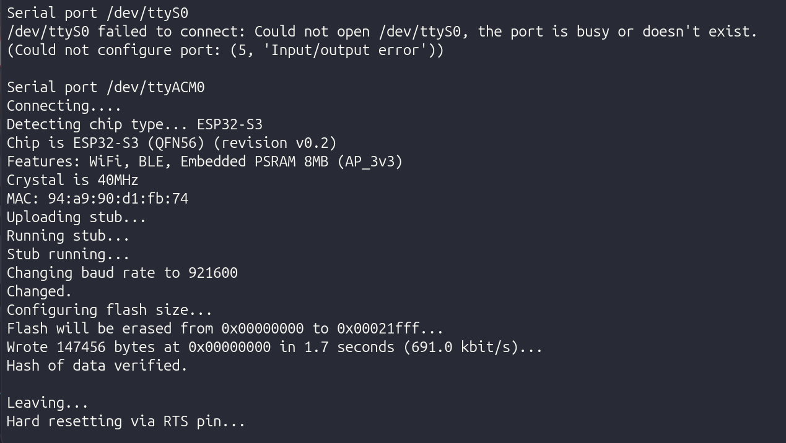
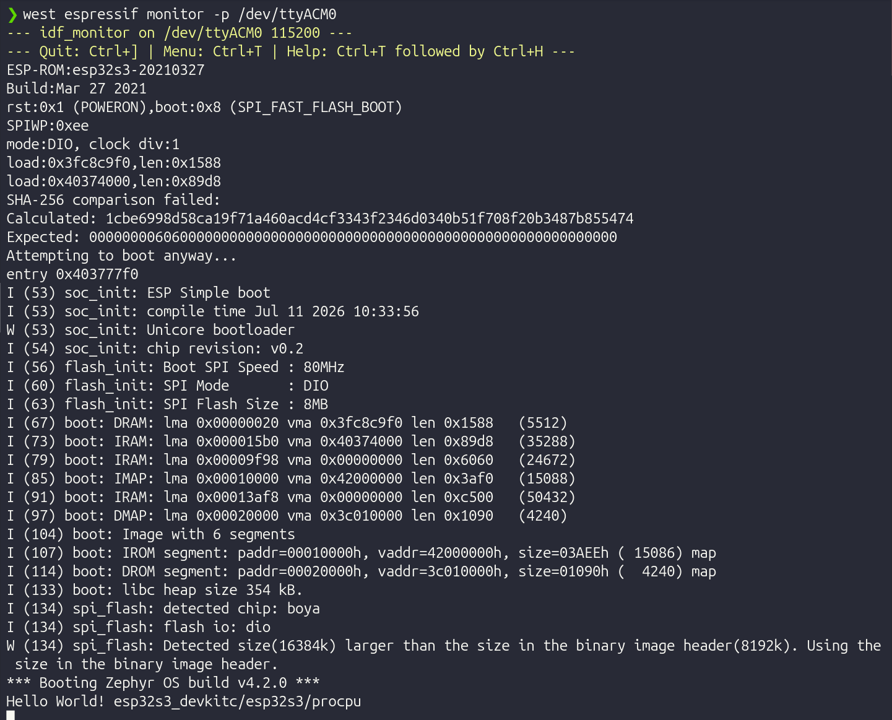

# Bagian 2 — Build dan Jalankan Aplikasi Pertama

Dengan environment sudah siap dari [Bagian 1](../01-workspace-dan-toolchain/README.md), sekarang build sample `hello_world` yang sudah ada di dalam source tree Zephyr, flash ke board, dan lihat outputnya lewat serial monitor. Setelah itu baru dimodifikasi sedikit sebagai latihan.

Aktifkan dulu venv kalau terminal baru:

```bash
source ~/zephyrproject/.venv/bin/activate
```

## Build

```bash
cd ~/zephyrproject/zephyr
west build -p always -b esp32s3_devkitc/esp32s3/procpu samples/hello_world
```

Penjelasan tiap bagian perintah:

- `-p always` artinya "pristine build", build directory dibersihkan dan dibuat ulang dari nol setiap kali. Berguna waktu belajar supaya tidak ada sisa cache konfigurasi lama yang bikin bingung. Setelah nanti sudah paham alur, bisa dihilangkan supaya build incremental lebih cepat.
- `-b esp32s3_devkitc/esp32s3/procpu` menentukan target board. Format qualifier Zephyr sekarang tiga bagian: `<board>/<soc>/<core>`. ESP32-S3 punya dua core (`procpu` dan `appcpu`), untuk aplikasi single-core biasa selalu pakai `procpu`.
- `samples/hello_world` adalah path relatif ke aplikasi yang mau di-build, dalam kasus ini contoh bawaan Zephyr.

Hasil build ada di `build/zephyr/zephyr.elf` dan `build/zephyr/zephyr.bin`. Di akhir output, perhatikan baris penggunaan memori:

```
Memory region         Used Size  Region Size  %age Used
           FLASH:       XX KB       XX MB      X.XX%
             RAM:       XX KB       XXX KB      X.XX%
```

Kalau baris ini muncul tanpa error di atasnya, build berhasil.

## Flash ke board

```bash
west flash
```

West otomatis mendeteksi runner flashing yang cocok untuk board ESP32-S3 (memakai `esptool.py` di balik layar). Kalau board tidak terdeteksi otomatis, tentukan port secara eksplisit:

```bash
west flash --esp-device /dev/ttyACM0
```

Ganti `/dev/ttyACM0` dengan device yang sesuai hasil pengecekan `dmesg` seperti dijelaskan di Bagian 1.

Jebakan yang sering terjadi: flashing gagal dengan pesan `A fatal error occurred: Failed to connect to ESP32-S3: Timed out waiting for packet header`. Kalau ini muncul, tahan tombol **BOOT** di board sesaat sebelum dan selama proses koneksi awal esptool (biasanya beberapa detik pertama setelah `west flash` mulai jalan), lalu lepas setelah proses upload benar-benar mulai (biasanya ditandai progress percentage yang mulai bergerak). Ini karena sebagian board DevKitC-1 tidak auto-reset ke bootloader mode dengan sinyal DTR/RTS default, tergantung revisi PCB dan driver USB-serial yang dipakai.



## Serial monitor

Setelah flash berhasil, board langsung reboot dan mulai menjalankan aplikasi. Untuk melihat output serial:

```bash
west espressif monitor
```

Kalau device port perlu ditentukan manual:

```bash
west espressif monitor -p /dev/ttyACM0
```

Harusnya muncul output:

```
Hello World! esp32s3_devkitc/esp32s3/procpu
```

Keluar dari monitor dengan `Ctrl+]`. Kalau `west espressif monitor` tidak dikenali (versi Zephyr lama sebelum runner ini ditambahkan), alternatif universal yang selalu ada adalah `west espressif monitor` diganti `minicom` atau `screen`:

```bash
screen /dev/ttyACM0 115200
```

Keluar dari `screen` dengan `Ctrl+A` lalu `K` lalu konfirmasi `y`.



## Latihan

Kode latihan ada di [src/main.c](src/main.c) beserta [src/CMakeLists.txt](src/CMakeLists.txt) dan [src/prj.conf](src/prj.conf) supaya bisa langsung di-build sebagai aplikasi berdiri sendiri, tanpa masuk ke source tree Zephyr:

```bash
cd 02-aplikasi-pertama
west build -p always -b esp32s3_devkitc/esp32s3/procpu src
west flash
west espressif monitor
```

Yang saya ubah dari `hello_world` standar: pesan outputnya, dan tambahan print versi kernel Zephyr yang sedang jalan lewat macro `KERNEL_VERSION_STRING`. Ini berguna sebagai kebiasaan baik — kalau nanti punya banyak board dengan versi Zephyr berbeda-beda, print versi di boot membantu debugging "kok perilakunya beda" ternyata karena versi Zephyr-nya juga beda.

## Ringkasan command

Tabel ini rekap semua command yang dipakai di bagian ini, buat referensi cepat tanpa harus scroll ulang.

| Command | Fungsi | Kapan dipakai |
|---|---|---|
| `source ~/zephyrproject/.venv/bin/activate` | Aktifkan Python venv | Setiap buka terminal baru sebelum kerja dengan west |
| `west build -p always -b <board> <path>` | Build aplikasi dari nol (pristine) | Build pertama kali, ganti board, atau ganti devicetree overlay |
| `west build` | Build incremental (tanpa `-p`, pakai konfigurasi build sebelumnya) | Build ulang setelah cuma edit source code, lebih cepat |
| `west flash` | Flash hasil build ke board, port dideteksi otomatis | Setelah build sukses dan board tersambung |
| `west flash --esp-device <port>` | Flash dengan port serial ditentukan manual | Kalau auto-detect gagal atau ada lebih dari satu board tersambung |
| `west espressif monitor` | Buka serial monitor, port dideteksi otomatis | Melihat output `printk`/log setelah board menyala |
| `west espressif monitor -p <port>` | Serial monitor dengan port manual | Sama seperti di atas, kalau auto-detect gagal |
| `screen <port> 115200` | Alternatif serial monitor universal | Kalau `west espressif monitor` tidak tersedia di versi Zephyr yang dipakai |
| `dmesg \| tail -20` | Lihat device serial yang baru terdeteksi | Cari tahu board muncul di `/dev/ttyACM0` atau `/dev/ttyUSB0` |

Opsi tambahan untuk `west build` yang sering berguna meski tidak dipakai eksplisit di atas:

| Flag | Fungsi |
|---|---|
| `-b <board>` | Tentukan board target, wajib ada di build pertama untuk direktori build tersebut |
| `-p always` | Pristine build, selalu bersihkan folder `build/` dulu |
| `-p auto` | Default kalau `-p` tidak ditulis — west deteksi otomatis perlu pristine atau tidak |
| `-p never` | Selalu incremental, tidak pernah bersihkan otomatis |
| `-d <dir>` | Pakai direktori build custom, bukan `build/` default |
| `-t <target>` | Jalankan target build tertentu, misal `menuconfig` untuk buka UI konfigurasi Kconfig |
| `--sysbuild` | Aktifkan sysbuild, build multi-image (berguna nanti untuk MCUboot/OTA) |

## Sumber

- [Zephyr samples/hello_world](https://github.com/zephyrproject-rtos/zephyr/tree/main/samples/hello_world)
- [West build command reference](https://docs.zephyrproject.org/latest/develop/west/build-flash-debug.html)
- [Espressif west runner](https://docs.espressif.com/projects/zephyr/en/latest/flash_debug.html)
